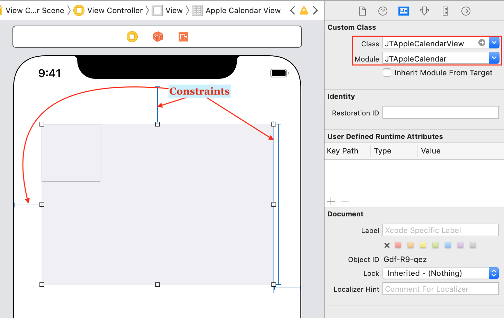
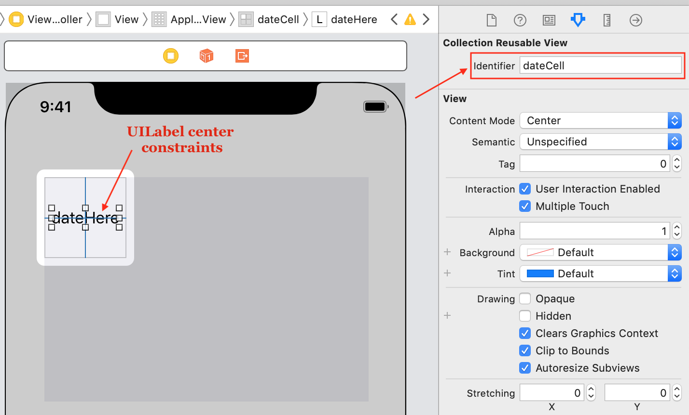
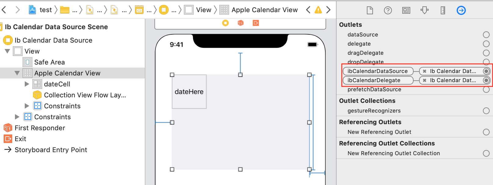

# Build a Calendar from scratch

## HELP REQUIRED - Using SwiftUI

> [!NOTE]
> This section is incomplete, please help update it by submitting a PR

## Using story board

1. Drag a UICollectionView unto the screen. Change its class and module to JTAppleCalendarView and JTAppleCalendar respectively.

Correctly set both the height and width constraints. Constraints are needed for the library to determine cell size.



2. UICollectionView may come with default minimum-cell-spacing and minimum-line-spacing. Unless your design requires it, please set both to zero as shown below.


3. Design the cell. This example uses a single UILabel. But this design can be anything (example images, rounded selections, dot-views for events etc).

Be sure to set correct constraints for the label (typically center the label in the cell both vertically and horizontally). Improper constraints results in bugged views. Also remember to set the cell’s `reusableIdentifier` to `dateCell`.



4. Create a new cell class.

```swift
import JTAppleCalendar
import UIKit
class DateCell: JTAppleCell {
    @IBOutlet var dateLabel: UILabel!
}
```

Now head back to Storyboard. The cell’s class is already set, so just connect the IBOutlet to the UILabel of the cell.


5. Now lets write some more code.

The following is self explanatory.

```swift
import UIKit
import JTAppleCalendar
class ViewController: UIViewController {
    override func viewDidLoad() {
        super.viewDidLoad()
    }
}
```

6. Go back to Storyboard and set the calendar’s ibCalendarDataSource and ibCalendarDelegate to be the ViewController subclass.



Write some more code.

This is the first required delegate.

```swift
extension ViewController: JTAppleCalendarViewDataSource {
    func configureCalendar(\_ calendar: JTAppleCalendarView) -> ConfigurationParameters {
        let formatter = DateFormatter()
        formatter.dateFormat = "yyyy MM dd"
        let startDate = formatter.date(from: "2018 01 01")!
        let endDate = Date()
        return ConfigurationParameters(startDate: startDate, endDate: endDate)
    }
}
```

This library is a ranged calendar. It has no infinite scrolling out-of-the-box (although some creative developers have accomplished it). There are 2 mandatory parameters, `startDate` for `startMonth`, and `endDate` for `endMonth`.

ConfigurationParameters full parameter list is:

- **startDate** – start boundary for calendar
- **endDate** – end boundary for calendar
- **numberOfRows** – default is 6
- **calendar** – this calendar() instance is responsible for region/timezones and the way your calendar will look in case you want an Arabic calendar for example. If none is given, the default iOS Calendar instance is provided.
- **generateInDates** – control the generation of inDates.
- **generateOutDates** – control the generation of outDates.
- **firstDayOfWeek** – set any day to be the first day of the week. Sunday is default.
- **hasStrictBoundaries** – controls the strictness of month boundaries.

These are the final 2 delegate functions.

```swift
extension ViewController: JTAppleCalendarViewDelegate {
    func calendar(_ calendar: JTAppleCalendarView, cellForItemAt date: Date, cellState: CellState, indexPath: IndexPath) -> JTAppleCell {
        let cell = calendar.dequeueReusableJTAppleCell(withReuseIdentifier: "dateCell", for: indexPath) as! DateCell
        cell.dateLabel.text = cellState.text
        return cell
    }
    func calendar(_ calendar: JTAppleCalendarView, willDisplay cell: JTAppleCell, forItemAt date: Date, cellState: CellState, indexPath: IndexPath) {
        let cell = cell as! DateCell
        cell.dateLabel.text = cellState.text
    }
}
```

These 2 functions should contain the same code, therefore it is wise to have a shared function to reduce code duplication. The only difference between these two functions should be the first line of code (the dequeuing code). Reasons for the 2 functions having the same code are found [here](https://github.com/patchthecode/JTAppleCalendar/issues/553) under problem#1.

Now run your test app and you should have a simple calendar going. If you wish to have paging enabled or have the scrollBar be invisible etc etc, then just remember that this library is a UICollectionView. Therefore enabling and hiding these are done the exact same way as a UICollectionView.

## Next Steps

Where to go from here? Configuring inDates/OutDates
